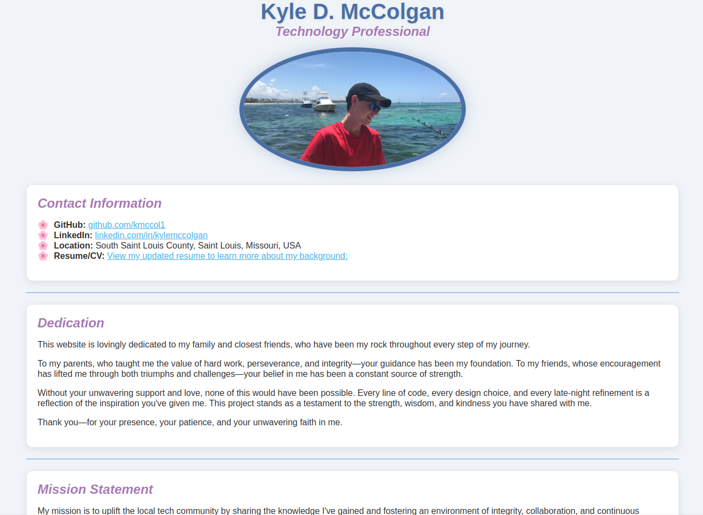

[](https://github.com/kmccol1/kmccol1.github.io/actions/workflows/autograding.yml)

# Kyle McColgan – Technology Professional

Welcome! 👋

This repository contains the source code for my personal website, designed to showcase my technical skills, projects, and journey in web development. Built with React, Vite, and GitHub Pages, this site reflects my approach to creating efficient, user-friendly, and secure web solutions.

Feel free to explore my work, and don’t hesitate to reach out if you're interested in collaborating, sharing insights, or discussing new ideas!


*A glimpse of my personal website, with a screenshot, designed to highlight my work in web development and security.*

## About Me

Hi, I'm Kyle McColgan! I'm a technology professional and security enthusiast based in Saint Louis. I specialize in building custom, practical web solutions that prioritize both usability and security. My approach emphasizes streamlined user experiences alongside robust security practices, ensuring that applications are not only efficient and scalable but also resilient.

I’m always eager to collaborate, exchange ideas, and tackle complex challenges with fellow developers and security professionals. Whether it’s contributing to open-source projects, discussing emerging security trends, or refining innovative web solutions—let’s build something impactful together!

## Skills

- **Programming Languages:** Proficient in Java and JavaScript, and SQL.
- **Web Development:** Focused on creating responsive, accessible, and user-centric designs.
- **Cybersecurity:** Hands-on experience with IT security fundamentals, and secure coding practices.

## Vision

I envision a digital landscape where security, accessibility, and innovation coexist seamlessly. My mission is to build secure, scalable, and user-first web solutions that empower individuals and organizations to navigate the online world with confidence.

Guided by a commitment to inclusivity, security, and continuous growth, I strive to develop technologies that break barriers, raise awareness of cybersecurity best practices, and set new standards for digital resilience.

As technology evolves, so does my drive to learn, adapt, and contribute to a future where digital experiences are not just functional, but also safe, intuitive, and empowering for all.

## Key Projects

### 1. [Snapshot Management Script](https://github.com/kmccol1/snapper-backups)
Automated Snapshot Management Script: A Bash script designed to automate and manage system snapshots using Snapper. This project enhances system reliability by creating, managing, and restoring snapshots efficiently. The system automatically transfers snapshot contents to a local host for external storage, ensuring minimal storage usage while maintaining comprehensive versioning. The script is lightweight, user-friendly, and integrates seamlessly with Linux environments.

### 2. [ShowMeTasks](https://github.com/kmccol1/showmetasks)
A full-stack to-do list application developed with Java Spring Boot and React. ShowMeTasks provides a clean and responsive interface for managing tasks, featuring user authentication, task creation and deletion, and RESTful APIs to enable seamless communication between the backend and frontend.

## Technologies Used

- **Languages:** HTML, CSS, JavaScript, React
- **Testing Framework:** Jest, for unit testing JavaScript functionality
- **Deployment:** GitHub Pages, for hosting and CI/CD
- **Version Control:** Git, managed through GitHub for collaboration and tracking changes

## How to Use

To explore the website locally:

1. Clone the repository:
    ```bash
    git clone https://github.com/kmccol1/kmccol1.github.io.git
    ```
2. Open `index.html` in your preferred web browser to view the site.

## Future Plans

- **Enhanced Features:** Introduce dynamic, interactive components using JavaScript.
- **Security Upgrades:** Adopt advanced secure web development practices.
- **Project Showcase:** Add more projects highlighting C++ and cybersecurity work.

## Contact

I'm always open to new opportunities, collaborations, or discussions about technology. Feel free to connect with me:

- **LinkedIn:** [Kyle McColgan](https://www.linkedin.com/in/kylemccolgan/)
- **GitHub:** [kmccol1](https://github.com/kmccol1)

Thank you for visiting my repository. I look forward to connecting!
