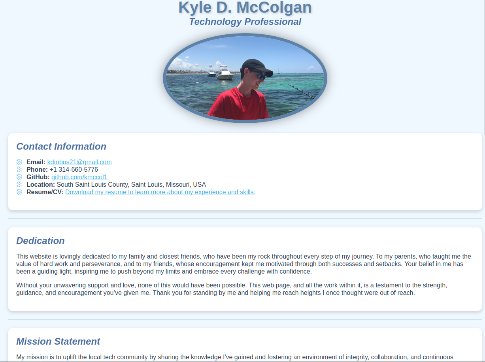

[](https://github.com/kmccol1/kmccol1.github.io/actions/workflows/autograding.yml)

# Kyle McColgan – Technology Professional

Welcome to my repository! This repository houses the source code for my website, built to showcase my technical skills, projects, and journey in web development. Explore my work and feel free to reach out if you'd like to collaborate or learn more.



## About Me

Hi, I'm Kyle McColgan—a technology professional and security enthusiast based in Saint Louis. I enjoy crafting custom, practical web solutions. My approach balances usability and security, ensuring high performance and seamless user experiences across all my projects.

I'm always excited to connect with others in the tech community. Whether it's collaborating on a project or sharing knowledge, let’s create something impactful together!

## Skills

- **Programming Languages:** Proficient in Java and JavaScript, and SQL.
- **Web Development:** Focused on creating responsive, accessible, and user-centric designs.
- **Cybersecurity:** Hands-on experience with IT security fundamentals, and secure coding practices.

## Vision

I am committed to crafting secure, scalable, and user-centric solutions in web development and network security. My mission is to create accessible digital experiences that empower users, advance cybersecurity practices, and set new standards in usability and performance. Driven by curiosity and a growth mindset, I continuously seek out learning opportunities to stay at the forefront of technology. I envision a future where my work not only keeps pace with the evolving tech landscape but also contributes meaningfully to the safety, inclusivity, and integrity of the digital world.

## Key Projects

### 1. [Flask Timer App](https://github.com/kmccol1/myTimer)
A minimalistic web application built using Python Flask, focusing on stopwatch functionality. This app follows the Unix philosophy of simplicity, offering users a sleek and responsive interface to track time effectively. Features include storing and displaying previous times, with plans for future enhancements such as timer functionality and user authentication.

### 2. [ShowMeTasks](https://github.com/kmccol1/showmetasks)
A full-stack to-do list application developed with Java Spring Boot and React. ShowMeTasks provides a clean and responsive interface for managing tasks, featuring user authentication, task creation and deletion, and RESTful APIs to enable seamless communication between the backend and frontend.

## Technologies Used

- **Languages:** HTML, CSS, JavaScript, React
- **Testing Framework:** Jest, for unit testing JavaScript functionality
- **Deployment:** GitHub Pages for hosting and CI/CD
- **Version Control:** Git, managed through GitHub for collaboration and tracking changes

## How to Use

To explore the website locally:

1. Clone the repository:
    ```bash
    git clone https://github.com/kmccol1/kmccol1.github.io.git
    ```
2. Open `index.html` in your preferred web browser to view the site.

## Future Plans

- **Enhanced Features:** Introduce dynamic, interactive components using JavaScript.
- **Security Upgrades:** Adopt advanced secure web development practices.
- **Project Showcase:** Add more projects highlighting C++ and cybersecurity work.

## Contact

I'm always open to new opportunities, collaborations, or discussions about technology. Feel free to connect with me:

- **Email:** [kdmbus21@gmail.com](mailto:kdmbus21@gmail.com)
- **LinkedIn:** [Kyle McColgan](https://www.linkedin.com/in/kylemccolgan/)
- **GitHub:** [kmccol1](https://github.com/kmccol1)

Thank you for visiting my repository. I look forward to connecting!
